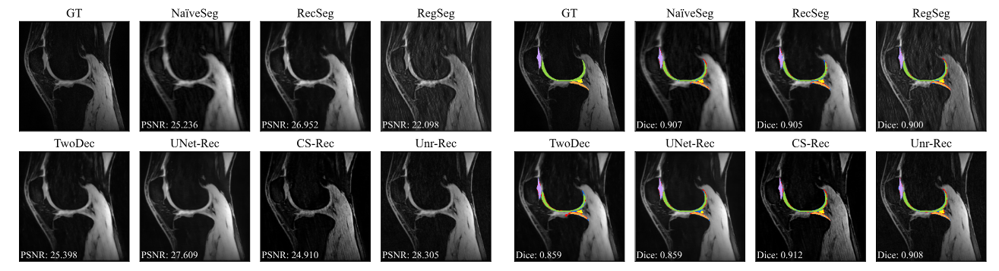

# Repository for "Understanding Benefits and Pitfalls of Current Methods for the Segmentation of Undersampled MRI Data"

This repository contains the code and data for the paper "Understanding Benefits and Pitfalls of Current Methods for the Segmentation of Undersampled MRI Data".



The code is largely based on the nnU-Net framework, on which we built most of the tested reconstruction and segmentation methods. 
If you are unfamiliar with the nnU-Net framework, please visit their GitHub repository for helpful documentations and tutorials [here](https://github.com/MIC-DKFZ/nnUNet/tree/nnunetv1).
Note that we are using nnU-Net Version 1.

## Data
The paper uses two datasets: The [K2S dataset](https://k2s.grand-challenge.org/) and the [SKM-TEA dataset](https://aimi.stanford.edu/datasets/skm-tea-knee-mri). 
Note that the K2S dataset unfortunately is [not public anymore](https://k2s.grand-challenge.org/Data/#we-are-not-sharing-any-data-after-the-challenge-has-been-concluded).

### Undersampling masks
For the SKM-TEA dataset, we utilize the provided undersampling masks for the undersampling factors 8x and 16x.
As the K2S dataset did only provide an undersampling mask of 8x, we had to generate the 16x, 32x, 64x, and 128x undersampling masks manually. 
The corresponding code that we used can be found [here](nnunet/dataset_conversion/create_masks.py).

### Network architectures
The network architectures that we used for the reconstruction and segmentation methods will be [here](nnunet/training/network_training/nnUNet_variants/paper_methods).

# Citation
If you find this repository useful, please consider citing our paper:
```
@misc{morshuis2025understandingbenefitspitfallscurrent,
      title={Understanding Benefits and Pitfalls of Current Methods for the Segmentation of Undersampled MRI Data}, 
      author={Jan Nikolas Morshuis and Matthias Hein and Christian F. Baumgartner},
      year={2025},
      eprint={2508.18975},
      archivePrefix={arXiv},
      primaryClass={eess.IV},
      url={https://arxiv.org/abs/2508.18975}, 
}
```

As our code is based on the nnU-Net framework, please also consider citing the nnU-Net paper:
```
@article{isensee2021nnu,
  title={nnU-Net: a self-configuring method for deep learning-based biomedical image segmentation},
  author={Isensee, Fabian and Jaeger, Paul F and Kohl, Simon AA and Petersen, Jens and Maier-Hein, Klaus H},
  journal={Nature methods},
  volume={18},
  number={2},
  pages={203--211},
  year={2021},
  publisher={Nature Publishing Group US New York}
}
```